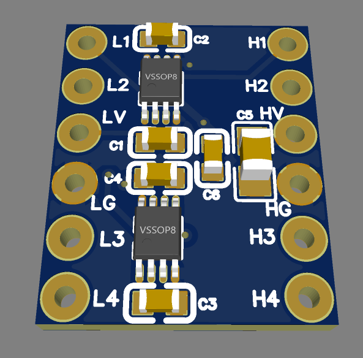
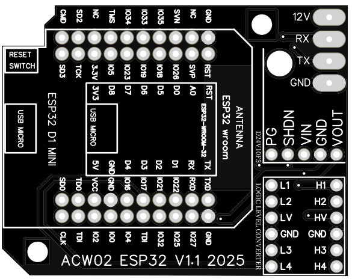
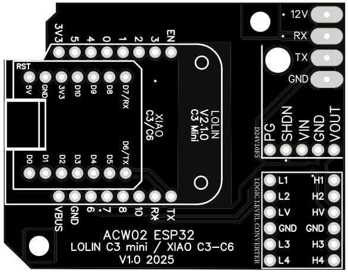
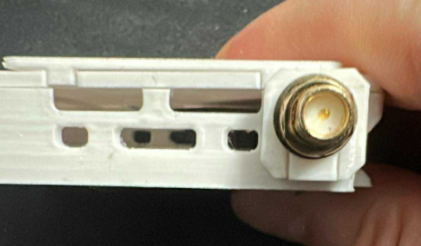
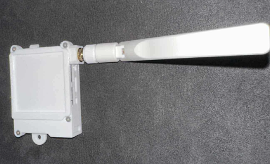
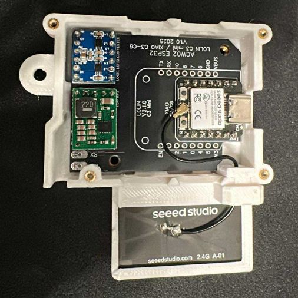
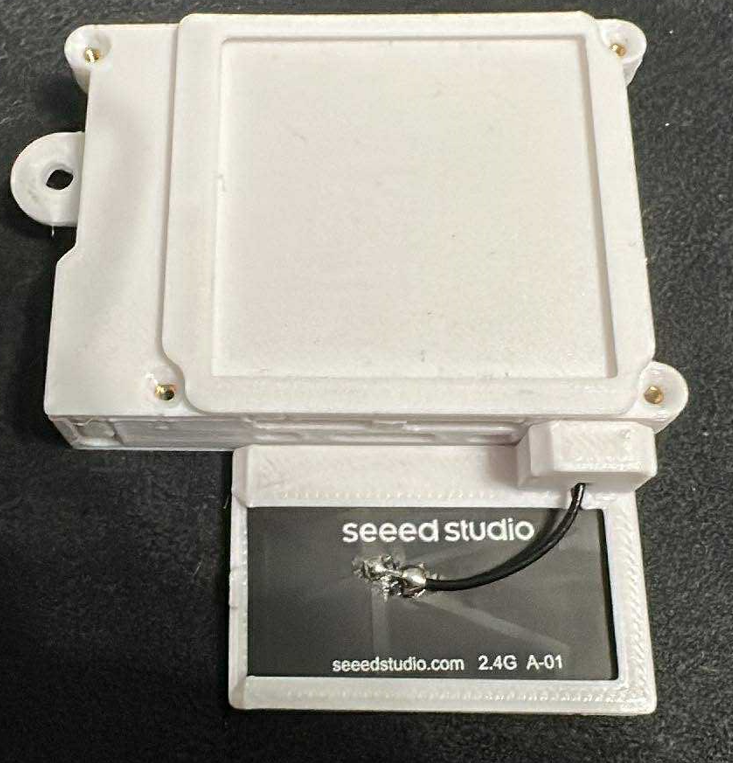
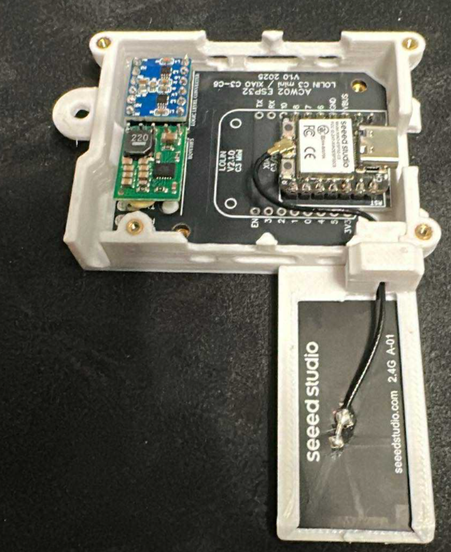
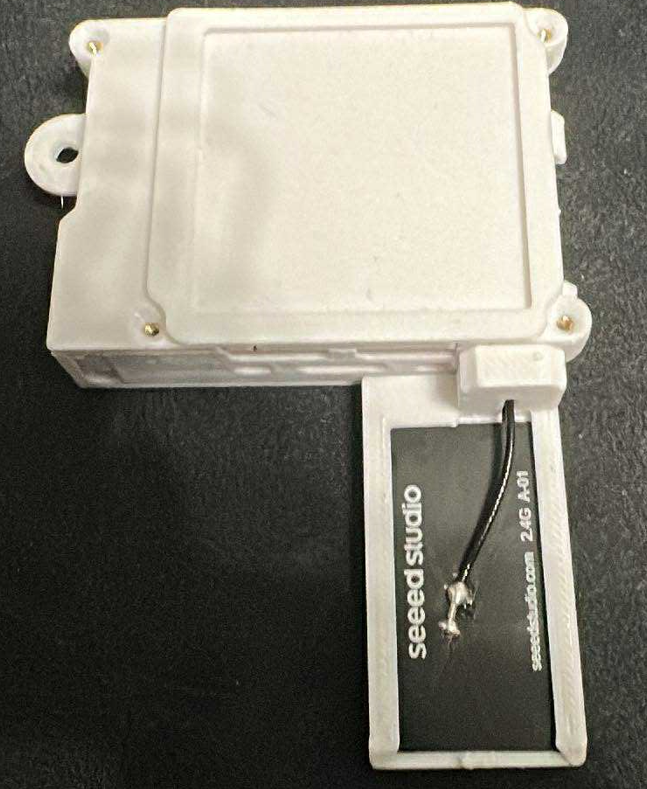
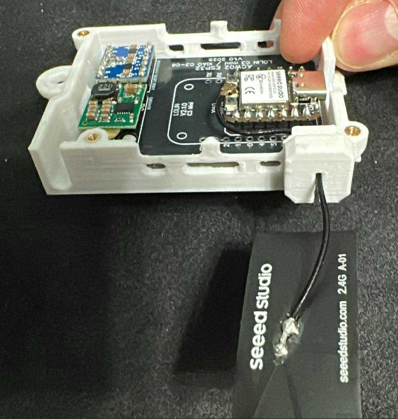

# ACW02 ESPHome Module  

Custom ESPHome component for **Teknopoint** and **Airton** AC units using the **Tuya ACW02 Wi-Fi module**.  

---

## Weekly build status

**ESP32 D1 Mini WROOM 32**  
 &nbsp;
 &nbsp;


**Lolin ESP32 C3 mini**  
 &nbsp;
 &nbsp;


**XIAO ESP32 C3**  
 &nbsp;
 &nbsp;


**XIAO ESP32 C6**  
 &nbsp;
 &nbsp;


---

## ⚠️ Compatibility Warning  

> **Important**  
> - Works on most **Teknopoint** units *(unconfirmed but no known issues so far, see the [Community Compatibility List](#-community-compatibility-list))*.  
> - Works on most **Airton** units *(unconfirmed but no known issues so far, see the [Community Compatibility List](#-community-compatibility-list))*.  

---

## ✅ Community Compatibility List  

A non-exhaustive list of tested models is available here:  
👉 [COMPATIBILITY.md](https://github.com/devildant/acw02_esphome/blob/main/COMPATIBILITY.md)  

---

## 📌 Contribute  

Help improve this project by reporting your unit compatibility.  
If your model is not referenced, please submit a report (**tested units only**):  
👉 [Submit your unit](https://github.com/devildant/acw02_esphome/issues/new?template=unit_report.yml)  

---

## 📋 Requirements

- Home Assistant with **MQTT integration** enabled and properly configured
- Enable the WIFI with the AC remote


## ⚙️ Settings

### 📁 Base Configuration

Open `esphome-acw02-en.yaml` or `esphome-acw02-fr.yaml` depending on your preferred language.

If you want to compile using the ESPHome Builder add-on in Home Assistant, use the files from the `HA-esphome-builder` folder instead (`ha-esphome-builder-acw02-en.yaml` or `ha-esphome-builder-acw02-fr.yaml`).

Edit the `substitutions` section — you can modify:

- `dev_name`
- `dev_friendly`
- `api_encrypted_key`
- `ota_password`
- `ap_password`
- `web_server_username`
- `web_server_password`

```yaml
substitutions:
  dev_name: acw02-salon
  dev_friendly: ACW02 salon
  lang: "en"
  api_encrypted_key: "D2oldc0VP++fni6src89tCSC0UwBhNPgyc8vgYN8/mA="
  ota_password: "REPLACE_WITH_YOUR_PASSWORD"
  ap_password: "fallbackpassword"
  web_server_username: admin
  web_server_password: admin
  # ESP32 D1 mini WROOM 32
  board: esp32dev
  TX: GPIO17
  RX: GPIO16
  
  ## LOLIN ESP32 C3 MINI
  # board: lolin_c3_mini
  # TX: GPIO21
  # RX: GPIO20

  ## XIAO (seeeds studio) ESP32 C3
  # board: seeed_xiao_esp32c3
  # TX: GPIO21
  # RX: GPIO20

  ## XIAO (seeeds studio) ESP32 C6
  # board: seeed_xiao_esp32c6
  # TX: GPIO16
  # RX: GPIO17
```

⚠️ **The configuration depends on the ESP32 card chosen (Comment/uncomment the blocks)**  
 - **ESP32 D1 mini WROOM 32**
    ```
    # ESP32 D1 mini WROOM 32
    board: esp32dev
    TX: GPIO17
    RX: GPIO16
    ```
 - **LOLIN ESP32 C3 MINI**
    ```
    # LOLIN ESP32 C3 MINI
    board: lolin_c3_mini
    TX: GPIO21
    RX: GPIO20
    ```
 - **XIAO (seeeds studio) ESP32 C3**
    ```
    # XIAO (seeeds studio) ESP32 C3
    board: seeed_xiao_esp32c3
    TX: GPIO21
    RX: GPIO20
    ```
 - **XIAO (seeeds studio) ESP32 C6**
    ```
    # XIAO (seeeds studio) ESP32 C6
    board: seeed_xiao_esp32c6
    TX: GPIO16
    RX: GPIO17
    ```

🔑 I recommend visiting [this page](https://esphome.io/components/api.html) to generate a unique `api_encrypted_key`.

---

### 📶 Wi-Fi & Web Server Configuration

Open `secrets.yaml` and fill in your Wi-Fi credentials and desired web server access:

```yaml
wifi_ssid: "testesp32"
wifi_password: "testesp32"
wifi_ssid2: "testesp32"
wifi_password2: "testesp32"
wifi_ssid3: "testesp32"
wifi_password3: "testesp32"
```

---

## 🛠️ Build

- [Build on Windows (native)](docs/install_from_windows_directly.md)  
- [Build on Windows with Docker](docs/install_from_docker_win.md)
- Build with ESPHome Builder (2025.7.5 minimum) with Home Assistant add-on:  
  Use the files in the [`HA-esphome-builder`](HA-esphome-builder) folder with the Home Assistant ESPHome add-on:  
  - [`ha-esphome-builder-acw02-fr.yaml`](HA-esphome-builder/ha-esphome-builder-acw02-fr.yaml) – version française  
  - [`ha-esphome-builder-acw02-en.yaml`](HA-esphome-builder/ha-esphome-builder-acw02-en.yaml) – English version  

### 📦 Update

> **🔁 After updating:**  
> I recommend pressing the **"G1: Rebuild MQTT Entities"** button to ensure all MQTT discovery topics are refreshed properly.

---

## 🔍 Interface Details

👉 [See Interface Details](docs/interface_details.md)

---

### 📦 Components

- **[12V → 5V Regulator D24V10F5](https://shop.mchobby.be/fr/regulateurs/554--regul-5v-1a-step-down-d24v10f5-3232100005549-pololu.html)**  
  [Manufacturer](https://www.pololu.com/product/2831)  
  

- **Channels Logic Level Converter**

  > **2 options available:**  
  > You can either choose a ready-made module based on the CYT1076,  
  > or use a custom board (to be assembled by JLCPCB) designed around two SN74LVC2T45DCUR.  
  > In practice, the second solution is far more optimized for UART communication.  
  > Personally, I recommend this option: a bit more expensive but much more efficient.  
  > (Of course, I might be slightly biased since I designed it myself 🙂)

  - **[4 Channels Logic Level Converter Bi-Directional Shifter (x1): CYT1076](https://amzn.eu/d/2MhG08s)**  
    

  - **Channels Logic Level Converter (x1): SN74LVC2T45DCUR**  
      
    - 📥 [Download ZIP (GERBER, BOM, Pick & Place)](https://github.com/devildant/acw02_esphome/raw/main/PCB/logic_level_converter/uart_conv_gerber_BOM_PickAndPlace.zip)
    - 👉 [JLCPCB Assembly Guide](docs/uart_convert_jlcpcb.md)

- **PCB and ESP32 (2 options available)**

  - **[ESP32 D1 MINI WROOM 32](https://github.com/devildant/acw02_esphome/blob/main/docs/version_esp32_D1_mini_wroom32.md)**  
      
    

  - **[LOLIN ESP32 C3 MINI](https://github.com/devildant/acw02_esphome/blob/main/docs/version_lolin_esp32_C3.md)**  
    

  - **[XIAO ESP32 C3-C6](https://github.com/devildant/acw02_esphome/blob/main/docs/version_xiao_esp32_C3_C6.md)**  
    


- **[5 pins male 2.54mm (x1): MaleL7.5-1X5P](https://fr.aliexpress.com/item/1005007128029220.html)**  
  

- **[6 pins male 2.54mm (x2): MaleL7.5-1X6P](https://fr.aliexpress.com/item/1005007128029220.html)**  
  

- **[Connector: JST XA 2.5 male 4 pins (Reverse direction) (x1)](https://www.aliexpress.com/item/1005008857984831.html)**  
  

📌 Important: Use reverse wiring for the following order:  


---

### ⚙️ Choosing the ESP32 Board

Several ESP32 boards can be used with this module. Each has its own pros and cons depending on your needs.

#### ESP32 D1 MINI WROOM 32
- ✅ Used for development, therefore the most tested version  
- ✅ Built-in **reset** button on the case  
- ❌ Many cheap clones with poor 5V → 3.3V regulator (may cause malfunction)  
- ❌ Slightly weaker Wi-Fi signal due to component layout and antenna position  
- ❌ No external antenna support  

#### LOLIN ESP32 C3 MINI
- ✅ Built-in **reset** button on the case  
- ✅ Better Wi-Fi signal compared to ESP32 D1 MINI WROOM 32  
- ❌ No external antenna support  

#### XIAO ESP32 C3
- ✅ External antenna support (Wi-Fi signal ≥ LOLIN ESP32 C3 MINI)  
- ❌ No **reset** button on the case  

#### XIAO ESP32 C6
- ✅ External antenna support  
- ❌ Antenna **not included** (must be purchased separately, internal antenna has very poor reception) 
- ❌ No **reset** button on the case  
- ❌ Average Wi-Fi signal, often weaker than ESP32 D1 MINI WROOM 32 with internal antenna (that's why you need buy the external antenna)

---

### 🧵 PCB Soldering & Wiring

- RED = 12V  
- BLACK = RX  
- YELLOW = TX  
- GREEN = GND

---

## 🧱 3D Files

### 🖨️ Printing Material  

| Material | Compatible | Notes |
|----------|------------|-------|
| PLA      | ❌ No       | Not recommended (low heat resistance) |
| PETG     | ✅ Yes (recommended) | Good balance of strength & printability |
| ABS      | ✅ Yes      | Better heat resistance |
| ASA      | ✅ Yes      | UV resistant, suitable for outdoors |
| PC       | ✅ Yes      | Very strong & heat resistant |

> ⚠️ **Why not use PLA?**  
> - PLA has a glass transition temperature of only **45–50 °C (or even lower)**.  
> - By contrast, **PETG can withstand up to ~80 °C**, making it much more reliable.  
> - For electronic components that generate heat, PLA is unsafe in warm environments — especially if your AC unit also provides **heating**.  

### 📂 Available in the `3Dfiles/` directory:

#### Version 1

- [acw02 case bottom (.stl)](https://github.com/devildant/acw02_esphome/raw/main/3Dfiles/D1-MIMI/Version%201/acw02%20case%20bot.stl)
- [acw02 case top (.stl)](https://github.com/devildant/acw02_esphome/raw/main/3Dfiles/D1-MIMI/Version%201/acw02%20case%20top.stl)
- [Alternative: top case with thermo cable hole](https://github.com/devildant/acw02_esphome/raw/main/3Dfiles/D1-MIMI/Version%201/acw02%20case%20top%20cable%20with%20thermo.stl)

#### Version 2

- [acw02 case bot with air flow (.stl)](https://github.com/devildant/acw02_esphome/raw/main/3Dfiles/D1-MIMI/Version%202/acw02%20case%20bot%20with%20air%20flow.stl)
- [acw02 case top air flow (.stl)](https://github.com/devildant/acw02_esphome/raw/main/3Dfiles/D1-MIMI/Version%202/acw02%20case%20top%20air%20flow.stl)
- [acw02 case top cable with thermo air flow (.stl)](https://github.com/devildant/acw02_esphome/raw/main/3Dfiles/D1-MIMI/Version%202/acw02%20case%20top%20cable%20with%20thermo%20air%20flow.stl)
- [acw02 case top cable with thermo plastic card (.stl)](https://github.com/devildant/acw02_esphome/raw/main/3Dfiles/D1-MIMI/Version%202/acw02%20case%20top%20cable%20with%20thermo%20plastic%20card.stl)
- [acw02 case top plastic card (.stl)](https://github.com/devildant/acw02_esphome/raw/main/3Dfiles/D1-MIMI/Version%202/acw02%20case%20top%20plastic%20card.stl)
- [card (.stl)](https://github.com/devildant/acw02_esphome/raw/main/3Dfiles/D1-MIMI/Version%202/card.stl)


 

#### For ESP32 D1 MINI WROOM 32
- [button.stl](https://github.com/devildant/acw02_esphome/raw/main/3Dfiles/D1-MIMI/button.stl)
- [solder board ESP32 D1 MINI.stl](https://github.com/devildant/acw02_esphome/raw/main/3Dfiles/D1-MIMI/solder%20board%20ESP32%20D1%20MINI.stl)

  

#### For LOLIN ESP32 C3 MINI
- [button lolin c3.stl](https://github.com/devildant/acw02_esphome/raw/main/3Dfiles/LOLIN-C3-XIAO-C3-C6/button%20lolin%20c3.stl)
- [solder board ESP32 C3-C6.stl](https://github.com/devildant/acw02_esphome/raw/main/3Dfiles/LOLIN-C3-XIAO-C3-C6/solder%20board%20ESP32%20C3-C6.stl)

  

#### For XIAO ESP32 C3-C6
- [solder board ESP32 C3-C6.stl](https://github.com/devildant/acw02_esphome/raw/main/3Dfiles/LOLIN-C3-XIAO-C3-C6/solder%20board%20ESP32%20C3-C6.stl)

  

- support antenna (multiple config possible)
  - support antenna rigid
    - [support antenna rigid part A.stl](https://github.com/devildant/acw02_esphome/raw/main/3Dfiles/LOLIN-C3-XIAO-C3-C6/support%20antenna%20rigid%20part%20A.stl)
    - [support antenna rigid part B.stl](https://github.com/devildant/acw02_esphome/raw/main/3Dfiles/LOLIN-C3-XIAO-C3-C6/support%20antenna%20rigid%20part%20B.stl)

      
      

  - [support antenna flex horizontal.stl](https://github.com/devildant/acw02_esphome/raw/main/3Dfiles/LOLIN-C3-XIAO-C3-C6/support%20antenna%20flex%20horizontal.stl)

    
    

  - [support antenna flex vertical.stl](https://github.com/devildant/acw02_esphome/raw/main/3Dfiles/LOLIN-C3-XIAO-C3-C6/support%20antenna%20flex%20vertical.stl)

    
    


  - [support antenna flex free.stl](https://github.com/devildant/acw02_esphome/raw/main/3Dfiles/LOLIN-C3-XIAO-C3-C6/support%20antenna%20flex%20free.stl)

    
    

#### BONUS: for airton support
You don't seem to have a mounting bracket for the module, so I'll provide one for you to stick on your air conditioner. :) (fix with double-sided tape)

- [support airton (.stl)](https://github.com/devildant/acw02_esphome/raw/main/3Dfiles/support%20for%20airton/support%20airton.stl)

---

### 🔩 Components

- [insert M2(OD3.2mm) Length 2.5mm 50pcs (x4)](https://www.aliexpress.com/item/1005003582355741.html)  
  

- [insert M3(OD4.2mm) Length 3mm 50pcs (x2)](https://www.aliexpress.com/item/1005003582355741.html)  
  

- [Optional: thermo white 4.8 mm x 10 m](https://amzn.eu/d/8Y1PVUU)  
    
  

- Countersunk head screw M2x6mm (x4)  
- Screw M3x4mm (x2) (+1 for airton support)

---

### 🧷 Assembly

1.   
2.   
3.   
4.   
5.   
6. 


#### BONUS : support airton

1. 

2. 

3. 

4. 

5. 

---

## 🧾 Option: QR Code Info

You can generate a QR code to store module information:

1. Open `create_QRcode_info.html` in your browser.  
2. Import your YAML file (`esphome-acw02-en.yaml` or `esphome-acw02-fr.yaml`).  
3. Verify the data and click the QR code to download.  
4. Print and stick it on the module.

---

## ❗ Notes

This component requires **MQTT** to work properly.  
Please ensure you understand how to configure it with Home Assistant.

> ⚠️ **WARNING**  
> Be careful with what you're doing, and make sure you have the necessary knowledge before attempting anything.  
> I am not responsible for any damage to your AC unit, ESP module, or other hardware.

---

# 🛡️ License

This repository uses multiple licenses depending on content type:

- **Code** (`*.yaml`, `*.cpp`, `*.h`) — [GNU GPLv3](https://www.gnu.org/licenses/gpl-3.0.html)
- **PCB files** (`*.zip`, `*.json`) — [CC BY-NC-SA 4.0](https://creativecommons.org/licenses/by-nc-sa/4.0/)
- **3D models** (`*.f3d`, `*.stl`) — [CC BY-NC-SA 4.0](https://creativecommons.org/licenses/by-nc-sa/4.0/)

> Commercial use of PCB and 3D files is **strictly prohibited**.
