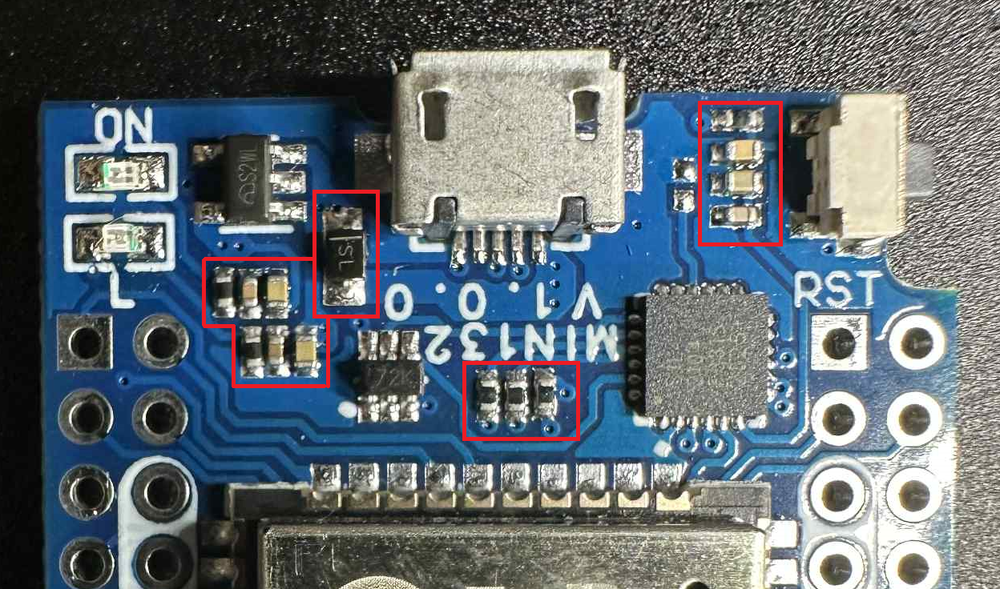

# ACW02 ESPHome Module  

Custom ESPHome component for **Teknopoint** and **Airton** AC units using the **Tuya ACW02 Wi-Fi module**.  

---

<!-- Statut du workflow GitHub -->


<!-- Badges dynamiques via JSON dans le repo -->


---

## ⚠️ Compatibility Warning  

> **Important**  
> - Works on most **Teknopoint** units *(unconfirmed but no known issues so far, see the [Community Compatibility List](#-community-compatibility-list))*.  
> - Works on most **Airton** units *(unconfirmed but no known issues so far, see the [Community Compatibility List](#-community-compatibility-list))*.  

---

## ✅ Community Compatibility List  

A non-exhaustive list of tested models is available here:  
👉 [COMPATIBILITY.md](https://github.com/devildant/acw02_esphome/blob/main/COMPATIBILITY.md)  

---

## 📌 Contribute  

Help improve this project by reporting your unit compatibility.  
If your model is not referenced, please submit a report (**tested units only**):  
👉 [Submit your unit](https://github.com/devildant/acw02_esphome/issues/new?template=unit_report.yml)  

---

## 📋 Requirements

- Home Assistant with **MQTT integration** enabled and properly configured
- A working MQTT broker (e.g., Mosquitto)
- Enable the WIFI with the AC remote


## ⚙️ Settings

### 📁 Base Configuration

Open `esphome-acw02-en.yaml` or `esphome-acw02-fr.yaml` depending on your preferred language.

If you want to compile using the ESPHome Builder add-on in Home Assistant, use the files from the `HA-esphome-builder` folder instead (`ha-esphome-builder-acw02-en.yaml` or `ha-esphome-builder-acw02-fr.yaml`).

Edit the `substitutions` section — you can modify:

- `dev_name`
- `dev_friendly`
- `api_encrypted_key`
- `ota_password`
- `ap_password`
- `web_server_username`
- `web_server_password`

```yaml
substitutions:
  dev_name: acw02-salon
  dev_friendly: ACW02 salon
  lang: "en"
  api_encrypted_key: "D2oldc0VP++fni6src89tCSC0UwBhNPgyc8vgYN8/mA="
  ota_password: "REPLACE_WITH_YOUR_PASSWORD"
  ap_password: "fallbackpassword"
  web_server_username: admin
  web_server_password: admin
  board: esp32dev
```

🔑 I recommend visiting [this page](https://esphome.io/components/api.html) to generate a unique `api_encrypted_key`.

---

### 📶 Wi-Fi & Web Server Configuration

Open `secrets.yaml` and fill in your Wi-Fi credentials and desired web server access:

```yaml
wifi_ssid: "testesp32"
wifi_password: "testesp32"
wifi_ssid2: "testesp32"
wifi_password2: "testesp32"
wifi_ssid3: "testesp32"
wifi_password3: "testesp32"
```

---

## 🛠️ Build

- [Build on Windows (native)](docs/install_from_windows_directly.md)  
- [Build on Windows with Docker](docs/install_from_docker_win.md)
- Build with ESPHome Builder with Home Assistant add-on:  
  Use the files in the [`HA-esphome-builder`](HA-esphome-builder) folder with the Home Assistant ESPHome add-on:  
  - [`ha-esphome-builder-acw02-fr.yaml`](HA-esphome-builder/ha-esphome-builder-acw02-fr.yaml) – version française  
  - [`ha-esphome-builder-acw02-en.yaml`](HA-esphome-builder/ha-esphome-builder-acw02-en.yaml) – English version  

### 📦 Update

> **🔁 After updating:**  
> I recommend pressing the **"G1: Rebuild MQTT Entities"** button to ensure all MQTT discovery topics are refreshed properly.

---

## 🔍 Interface Details

👉 [See Interface Details](docs/interface_details.md)

---

## 🧩 PCB

### 📂 Gerber files available in the `PCB/` directory:

📥 [Download GERBER file](https://github.com/devildant/acw02_esphome/raw/main/PCB/Gerber_climEspHome_esp32_d1_mini_PCB_climEspHome_esp32_d1_mini_2025-07-03.zip)

  


---

### 📦 Components

- **[12V → 5V Regulator D24V10F5](https://shop.mchobby.be/fr/regulateurs/554--regul-5v-1a-step-down-d24v10f5-3232100005549-pololu.html)**  
  [Manufacturer](https://www.pololu.com/product/2831)  
  

- **[4 Channels Logic Level Converter Bi-Directional Shifter (x1): CYT1076](https://amzn.eu/d/2MhG08s)**  
  

- **[ESP32-WROOM-32 D1 Mini NodeMCU (micro usb version recommended (x1))](https://amzn.eu/d/3mS1B7W)**  
  

  > ⚠️ **Compatibility Warning**  
  > Avoid very cheap ESP32 D1 Mini clones (often found on AliExpress).  
  > Several users reported issues with these boards.  
  > Prefer trusted brands such as **AZDelivery** or other well-reviewed suppliers.  

  **❌ Symptoms of low-cost ESP32 incompatibility**  
  - Wi-Fi cannot be enabled on the AC (Wi-Fi logo never appears).  
  - ESP LED turns on briefly, then shuts off.  
  - Voltage on VCC drops from 5 V to ~1.8–2 V when connected to the AC board.  

  **🛠️ Why does this happen?**  
  Cheap ESP32 D1 Mini clones often cut corners in **power regulation** and **stability**:  
  - *Weak 5 V → 3.3 V regulator* — old AMS1117 regulators waste power and cannot handle Wi-Fi current peaks.  
  - *Poor decoupling capacitors* — cheap boards lack the capacitors needed to smooth fast spikes.  
  - *Inconsistent ESP32 modules* — some clones use non-genuine or B-grade chips.  

  **✅ Why AZDelivery & trusted brands work**  
  - Use original **Espressif WROOM-32** modules.  
  - Include a **modern LDO regulator** that tolerates bursts up to 500–600 mA.  
  - Proper capacitors ensure stable operation during Wi-Fi activity.  
  - As a result, even when powered from the AC’s limited 12 V port, they stay stable and connect without issue.

  **🔍 Observation**  
  By comparing ESP32 boards that work and those that don’t, I noticed visible differences.  
  If your ESP has the same configuration as in the image below (red square), it should *theoretically* be compatible.  
  It's just an observation, I don't know how to differentiate the good esp32 d1 mini cards from the bad ones, it's possible that cards with differences work
   

  Note: The images on the official AZDelivery website are not up to date, but they are on Amazon.


- **[5 pins male 2.54mm (x1): MaleL7.5-1X5P](https://fr.aliexpress.com/item/1005007128029220.html)**  
  

- **[6 pins male 2.54mm (x2): MaleL7.5-1X6P](https://fr.aliexpress.com/item/1005007128029220.html)**  
  

- **[10 pins male 2.54mm (x2): MaleL7.5-1X10P](https://fr.aliexpress.com/item/1005007128029220.html)**  
  

- **[Connector: JST XA 2.5 male 4 pins (Reverse direction) (x1)](https://www.aliexpress.com/item/1005008857984831.html)**  
  

📌 Important: Use reverse wiring for the following order:  


---

### 🧵 PCB Soldering & Wiring

  

- RED = 12V  
- BLACK = RX  
- YELLOW = TX  
- GREEN = GND

🔧 Solder pins between ESP32 and PCB (red square):  


📌 [See Solder Board Helper section](#solder-board-helper)

---

## 🧱 3D Files

### 🖨️ Printing Material  

| Material | Compatible | Notes |
|----------|------------|-------|
| PLA      | ❌ No       | Not recommended (low heat resistance) |
| PETG     | ✅ Yes (recommended) | Good balance of strength & printability |
| ABS      | ✅ Yes      | Better heat resistance |
| ASA      | ✅ Yes      | UV resistant, suitable for outdoors |
| PC       | ✅ Yes      | Very strong & heat resistant |

> ⚠️ **Why not use PLA?**  
> - PLA has a glass transition temperature of only **45–50 °C (or even lower)**.  
> - By contrast, **PETG can withstand up to ~80 °C**, making it much more reliable.  
> - For electronic components that generate heat, PLA is unsafe in warm environments — especially if your AC unit also provides **heating**.  

### 📂 Available in the `3Dfiles/` directory:

#### Version 1

- [acw02 case bottom (.stl)](https://github.com/devildant/acw02_esphome/raw/main/3Dfiles/Version%201/acw02%20case%20bot.stl)
- [acw02 case top (.stl)](https://github.com/devildant/acw02_esphome/raw/main/3Dfiles/Version%201/acw02%20case%20top.stl)
- [Alternative: top case with thermo cable hole](https://github.com/devildant/acw02_esphome/raw/main/3Dfiles/Version%201/acw02%20case%20top%20cable%20with%20thermo.stl)

#### Version 2

- [acw02 case bot with air flow (.stl)](https://github.com/devildant/acw02_esphome/raw/main/3Dfiles/Version%202/acw02%20case%20bot%20with%20air%20flow.stl)
- [acw02 case top air flow (.stl)](https://github.com/devildant/acw02_esphome/raw/main/3Dfiles/Version%202/acw02%20case%20top%20air%20flow.stl)
- [acw02 case top cable with thermo air flow (.stl)](https://github.com/devildant/acw02_esphome/raw/main/3Dfiles/Version%202/acw02%20case%20top%20cable%20with%20thermo%20air%20flow.stl)
- [acw02 case top cable with thermo plastic card (.stl)](https://github.com/devildant/acw02_esphome/raw/main/3Dfiles/Version%202/acw02%20case%20top%20cable%20with%20thermo%20plastic%20card.stl)
- [acw02 case top plastic card (.stl)](https://github.com/devildant/acw02_esphome/raw/main/3Dfiles/Version%202/acw02%20case%20top%20plastic%20card.stl)
- [card (.stl)](https://github.com/devildant/acw02_esphome/raw/main/3Dfiles/Version%202/card.stl)


 

#### BONUS: for airton support
You don't seem to have a mounting bracket for the module, so I'll provide one for you to stick on your air conditioner. :) (fix with double-sided tape)

- [support airton (.stl)](https://github.com/devildant/acw02_esphome/raw/main/3Dfiles/support%20for%20airton/support%20airton.stl)


#### Common
- [button.stl](https://github.com/devildant/acw02_esphome/raw/main/3Dfiles/button.stl)
- [solder board holder](https://github.com/devildant/acw02_esphome/raw/main/3Dfiles/solder%20board%2016%20hold.stl)

---

### 🔩 Components

- [insert M2(OD3.2mm) Length 2.5mm 50pcs (x4)](https://www.aliexpress.com/item/1005003582355741.html)  
  

- [insert M3(OD4.2mm) Length 3mm 50pcs (x2)](https://www.aliexpress.com/item/1005003582355741.html)  
  

- [Optional: thermo white 4.8 mm x 10 m](https://amzn.eu/d/8Y1PVUU)  
    
  

- Countersunk head screw M2x6mm (x4)  
- Screw M3x4mm (x2) (+1 for airton support)

---

### 🧷 Assembly

1.   
2.   
3.   
4.   
5.   
6. 


#### BONUS : support airton

1. 

2. 

3. 

4. 

5. 

---

### 🧰 Solder Board Helper

[solder_board.stl](3Dfiles/solder%20board%2016%20hold.stl)  
  


---

## 🧾 Option: QR Code Info

You can generate a QR code to store module information:

1. Open `create_QRcode_info.html` in your browser.  
2. Import your YAML file (`esphome-acw02-en.yaml` or `esphome-acw02-fr.yaml`).  
3. Verify the data and click the QR code to download.  
4. Print and stick it on the module.

---

## ❗ Notes

This component requires **MQTT** to work properly.  
Please ensure you understand how to configure it with Home Assistant.

> ⚠️ **WARNING**  
> Be careful with what you're doing, and make sure you have the necessary knowledge before attempting anything.  
> I am not responsible for any damage to your AC unit, ESP module, or other hardware.

---

# 🛡️ License

This repository uses multiple licenses depending on content type:

- **Code** (`*.yaml`, `*.cpp`, `*.h`) — [GNU GPLv3](https://www.gnu.org/licenses/gpl-3.0.html)
- **PCB files** (`*.zip`, `*.json`) — [CC BY-NC-SA 4.0](https://creativecommons.org/licenses/by-nc-sa/4.0/)
- **3D models** (`*.f3d`, `*.stl`) — [CC BY-NC-SA 4.0](https://creativecommons.org/licenses/by-nc-sa/4.0/)

> Commercial use of PCB and 3D files is **strictly prohibited**.
