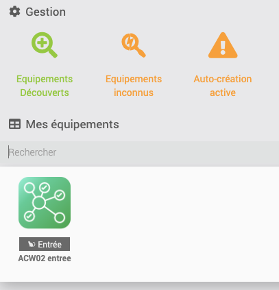
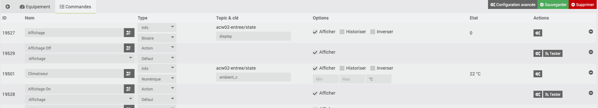

# Activation on Jeedom

**Prerequisites**
* Have an MQTT broker plugin
* Have the MQTT Discovery plugin (optional but highly recommended)

## 1. Installing MQTT Discovery
* Install the plugin
* Activate the plugin
* Configure (Automatic configuration if you have MQTT Manager)
* In the plugin, enable automatic discovery or add your ESP topic `dev_name` e.g. `acw02-salon`

## 2. From ESP Web Interface
* Configure the MQTT broker (see [Specific Jeedom Documentation](https://github.com/devildant/acw02_esphome/blob/main/docs/interface_details.md#-optional-mqtt-only-without-esphome-ha-integration-ex-not-connect-to-ha-with-esphome-or-jeedom))

## 3. From Jeedom
* Check the automatic addition of the module  
  

* View the commands  
  