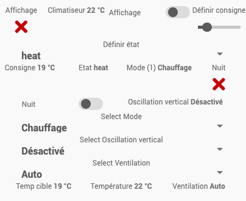

# Activation sous Jeedom

**Pré-requis**
* disposer d'un plugin broker MQTT
* disposer du plugin MQTT Discovery (optionnel mais fortement recommandé)

## 1. Installation de MQTT Discovery
* Installer le plugin
* Activer le plugin
* Configurer (Configuration automatique si vous possèdez MQTT Manager)
* Dans le plugin, activer la découverte automatique ou ajouter le topic de votre ESP `dev_name` ex. `acw02-salon`

## 2. Depuis ESP Interface Web
* Configurer le broker MQTT (cf [Documentation spécifique Jeedom](https://github.com/devildant/acw02_esphome/blob/main/docs/interface_details.md#-optional-mqtt-only-without-esphome-ha-integration-ex-not-connect-to-ha-with-esphome-or-jeedom))

## 3. Depuis Jeedom
* Contrôler l'ajout automatique du module  
  

* Visualiser les commandes  
  

* Visualiser le module
  
