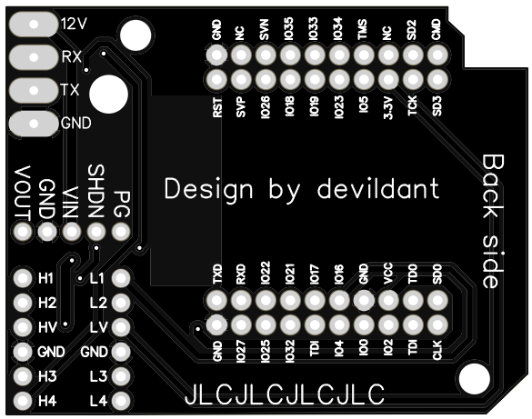

# ESP32 D1 mini WROOM 32 version
## 🧩 PCB

### 📂 Gerber files available in the `PCB/` directory:

#### 🟢 Stable version (v1.0) :
📥 [Download GERBER file](https://github.com/devildant/acw02_esphome/raw/main/PCB/esp32_D1_mini_wroom32/v1.0/Gerber_climEspHome_esp32_d1_mini_PCB_climEspHome_esp32_d1_mini_2025-07-03.zip)

  

#### 🟢 Stable version (v1.1) :
📥 [Download GERBER file](https://github.com/devildant/acw02_esphome/raw/main/PCB/esp32_D1_mini_wroom32/v1.1/Gerber_climEspHome_esp32_d1_mini_v1.1_PCB_climEspHome_esp32_d1_mini_v1.1_2025-09-08.zip)
 
> This revision removes the traces and copper layers under the **ESP32 antenna** to potentially improve Wi-Fi signal.  
> However, since the antenna is already raised above the PCB by the pin headers, the improvement may be negligible.  
> The PCB is **ordered but not yet tested**. 

  

---

### 📦 Components

- **[ESP32-WROOM-32 D1 Mini NodeMCU (micro usb version recommended (x1))](https://amzn.eu/d/3mS1B7W)**  
  

  > ⚠️ **Compatibility Warning**  
  > Avoid very cheap ESP32 D1 Mini clones (often found on AliExpress).  
  > Several users reported issues with these boards.  
  > Prefer trusted brands such as **AZDelivery** or other well-reviewed suppliers.  

  **❌ Symptoms of low-cost ESP32 incompatibility**  
  - Wi-Fi cannot be enabled on the AC (Wi-Fi logo never appears).  
  - ESP LED turns on briefly, then shuts off.  
  - Voltage on VCC drops from 5 V to ~1.8–2 V when connected to the AC board.  

  **🛠️ Why does this happen?**  
  Cheap ESP32 D1 Mini clones often cut corners in **power regulation** and **stability**:  
  - *Weak 5 V → 3.3 V regulator* — old AMS1117 regulators waste power and cannot handle Wi-Fi current peaks.  
  - *Poor decoupling capacitors* — cheap boards lack the capacitors needed to smooth fast spikes.  
  - *Inconsistent ESP32 modules* — some clones use non-genuine or B-grade chips.  

  **✅ Why AZDelivery & trusted brands work**  
  - Use original **Espressif WROOM-32** modules.  
  - Include a **modern LDO regulator** that tolerates bursts up to 500–600 mA.  
  - Proper capacitors ensure stable operation during Wi-Fi activity.  
  - As a result, even when powered from the AC’s limited 12 V port, they stay stable and connect without issue.

  **🔍 Observation**  
  By comparing ESP32 boards that work and those that don’t, I noticed visible differences.  
  If your ESP has the same configuration as in the image below (red square), it should *theoretically* be compatible.  
  It's just an observation, I don't know how to differentiate the good esp32 d1 mini cards from the bad ones, it's possible that cards with differences work
   

  Note: The images on the official AZDelivery website are not up to date, but they are on Amazon.

- **[10 pins male 2.54mm (x2): MaleL7.5-1X10P](https://fr.aliexpress.com/item/1005007128029220.html)**  
  

  ---
  
  ### 🧵 PCB Soldering & Wiring
  
    
  
  - RED = 12V  
  - BLACK = RX  
  - YELLOW = TX  
  - GREEN = GND
  
  🔧 Solder pins between ESP32 and PCB (red square):  
  
  
---

### 🧰 Solder Board Helper

[solder board ESP32 D1 MINI.stl](https://github.com/devildant/acw02_esphome/raw/main/3Dfiles/D1-MIMI/solder%20board%20ESP32%20D1%20MINI.stl)  
  
