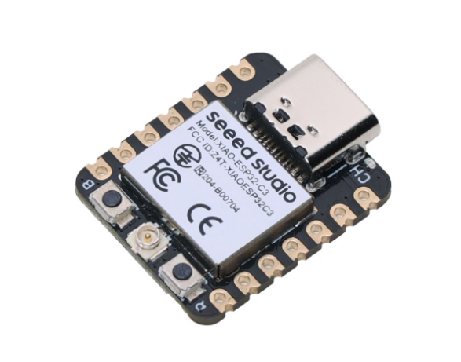
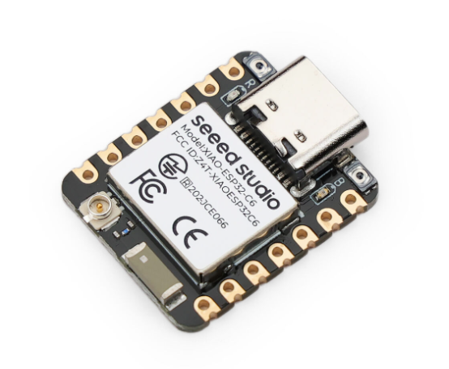
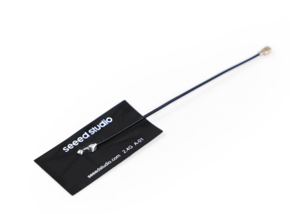

# LOLIN ESP32 C3 version
## 🧩 PCB

### 📂 Gerber files available in the `PCB/` directory:

#### 🟢 Stable version (v1.0) :
📥 [Download GERBER file](https://github.com/devildant/acw02_esphome/raw/main/PCB/lolin_c3_xiao_c3_xiao_c6/v1.0/Gerber_climEspHome_esp32_lolin_c3_xiao_c3_c6_PCB_climEspHome_esp32_lolin_c3_xiao_c3_2025-09-27.zip)

  

---

### 📦 Components

- **[ESP32 xiao C3 or C6 (x1)]**
  - **[LOLIN ESP32 C3 (x1)](https://www.seeedstudio.com/Seeed-XIAO-ESP32C3-p-5431.html)**  
  
  - **[LOLIN ESP32 C6 (x1)](https://www.seeedstudio.com/Seeed-Studio-XIAO-ESP32C6-p-5884.html)**  
  
    - **[external antenna (for c6 only because not provide) (x1)](https://www.seeedstudio.com/2-4GHz-FPC-Antenna-2-9dBi-for-XIAO-ESP32C3-p-6439.html)**  
    

- **[7 pins male 2.54mm (x2): MaleL7.5-1X7P](https://fr.aliexpress.com/item/1005007128029220.html)**  
  

  ---
  
  ### 🧵 PCB Soldering & Wiring
  
    
    
  
  - RED = 12V  
  - BLACK = RX  
  - YELLOW = TX  
  - GREEN = GND
  
  
---

### 🧰 Solder Board Helper

[solder board ESP32 C3-C6.stl](../3Dfiles/LOLIN-C3-XIAO-C3-C6/solder%20board%20ESP32%20C3-C6.stl)  
  
